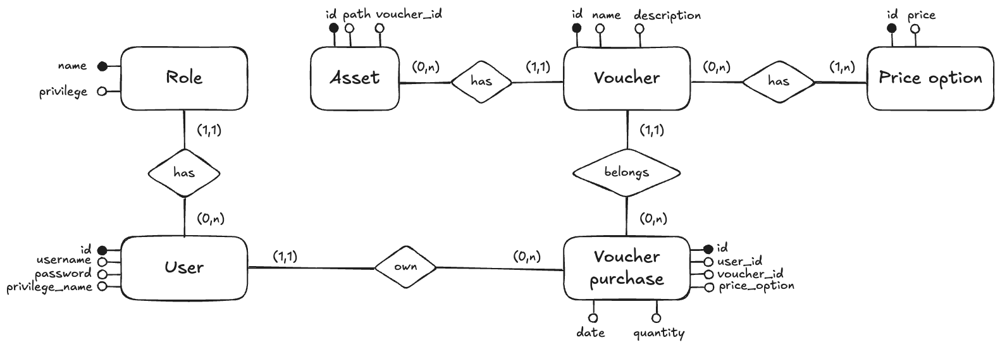

# Database

Durante la fase di progettazione ho dovuto riflettere su come impostare l’acquisto dei buoni. Da un lato, potevo interpretarli come dei buoni pasto, generati autonomamente dall’utente in base al proprio saldo; dall’altro, potevo trattarli come prodotti di un vero e proprio ecommerce, quindi acquistabili liberamente.

Alla fine ho optato per una soluzione "ibrida": poiché la consegna richiedeva la realizzazione di un ecommerce, ogni utente visualizza i vari voucher disponibili e può acquistare liberamente quelli che desidera. Considerandoli come “buoni digitali”, ho deciso di non gestire una quantità limitata di stock, consentendo quindi acquisti illimitati senza necessità di monitorare la disponibilità del prodotto.

Di seguito una panoramica dei modelli utilizzati nell’applicazione e delle relazioni tra le diverse entità.

## Role

Rappresenta il livello di privilegio associato a ciascun utente (es. system, admin, user).

**Campi principali**

- name (PK) – Nome del ruolo
- privilege – Identificativo numerico univoco del privilegio. Un valore più alto rappresenta un livello di privilegio superiore.

**Relazioni**

- 1 → N con User: Un privilegio può essere assegnato a più utenti.

> **⚠️ NB:** Questa rappresenta una semplificazione; in un contesto più complesso questa logica non sarebbe adeguata.

## User

Rappresenta un utente registrato nel sistema.

**Campi principali**

- id (PK)
- username
- password
- privilege_name (FK → Role.name)

**Relazioni**

- N → 1 con Role: Ogni utente appartiene a un solo privilegio.
- 1 → N con Voucher purchase: Un utente può effettuare più acquisti.

## Voucher purchase

Rappresenta un acquisto effettuato da un utente per un determinato voucher.

**Campi principali**

- id (PK)
- user_id (FK → User.id)
- voucher_id (FK → Voucher.id)
- price_option
- date
- quantity

**Relazioni**

- N → 1 con User: Ogni acquisto è effettuato da un singolo utente.
- N → 1 con Voucher: Ogni acquisto si riferisce a un singolo voucher.
- N → 1 con Price option: Ogni acquisto utilizza una specifica opzione di prezzo.

> **⚠️ NB:** Per semplificazione non ho legato price_option a Price option.id

## Voucher

Rappresenta un buono acquistabile all’interno dell’ecommerce.

**Campi principali**

- id (PK)
- name
- description

**Relazioni**

- 1 → N con Asset: Un voucher può avere uno o più asset associati.
- 1 → N con Price option: Un voucher può avere una o più opzioni di prezzo.
- 1 → N con Voucher purchase: Un voucher può essere acquistato più volte.

## Price Option

Rappresenta una possibile opzione di prezzo per un voucher (taglio).

**Campi principali**

- id (PK)
- price

**Relazioni**

- N → N con Voucher: Una price option può appertenere a più voucher.

## Asset

Rappresenta un file multimediale (generalmente un’immagine) associato a un voucher.

**Campi principali**

- id (PK)
- path
- voucher_id (FK → Voucher.id)

**Relazioni**

- N → 1 con Voucher: Ogni asset appartiene a un singolo voucher.
- 1 → N lato Voucher: Un voucher può avere più asset.

> **⚠️ NB:** Per semplificazione ho ipotizzato che un asset sia legato solo ad un voucher. In contesti più complessi, invece, gli asset potrebbero essere gestiti in modo più flessibile, ad esempio permettendo l’associazione dello stesso asset a più voucher o addirittura a modelli differenti.

